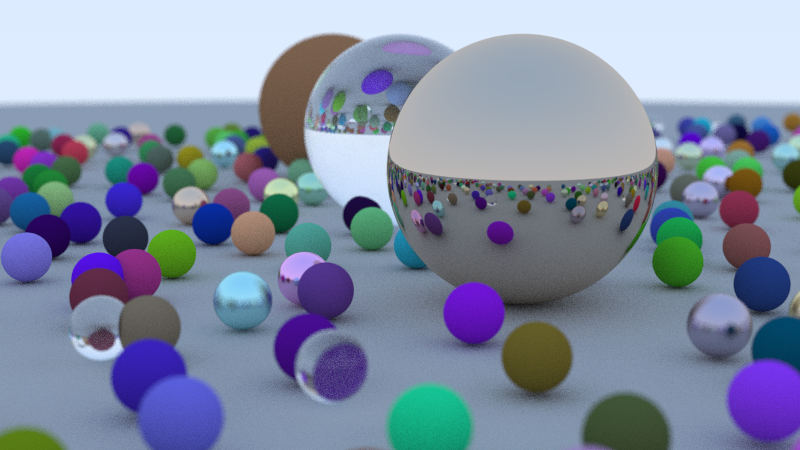

## Ray tracing in one weekend by CUDA

[Ray Tracing in One Weekend](https://github.com/LiuZengqiang/RayTracingInOneWeekend) in CUDA

### 简介：  
**RayTracingInOneWeekendCUDA** 是 [RayTracingInOneWeekend](https://github.com/LiuZengqiang/RayTracingInOneWeekend) 的CUDA版本实现。
### CUDA版本要求：
计算能力要大于等于6.0。 ``Compute capability >= 6.x``  
>> 因为代码中需要使用``atomicAdd(float*, float)``针对浮点数的原子操作，所以需要GPU的计算能力大于等于6.0。


### 如何运行：
```shell
mkdir build
./run.sh
```
### 示例结果：
* 场景1 (800*450, spp=100, max_depth=50)   
  
### 耗时对比：
| 场景   | 分辨率|spp|最大深度|CPU耗时(s)|GPU耗时(s)|  
| -- | --|-- |--|--|--|
| 场景1 | 800*450|100 |50|2019.81|26.82|

电脑配置：  
* CPU: Intel(R) Core(TM) i5-10400F CPU @ 2.90GHz  
* GPU: NVIDIA Corporation GP104 [GeForce GTX 1080] (rev a1)  
* CUDA: 11.4  
* nvidia Driver: 470.57.02   

### CUDA代码针对C++代码的修改：
在实现时，本仓库CUDA代码尽可能和[RayTracingInOneWeekend](https://github.com/LiuZengqiang/RayTracingInOneWeekend)中的代码相似，其中不得不该的部分主要分为以下几点：
1. 改``double``为``float``，因为``Current GPUs run fastest when they do calculations in single precision. Double precision calculations can be several times slower on some GPUs``；
2. 将需要在GPU端运行的函数前增加``__device__``函数修饰符号；
3. 将由CPU端调用，GPU端执行的函数从``类函数``改为``全局函数``，并将其他需要在GPU端运行、不适合做为``类函数``的函数改为``全局函数``；
4. CUDA不支持智能指针，将C++版本中的智能指针改为普通指针；
5. 改为在GPU端使用CUDA库产生随机数；
6. 每个光线申请一个GPU线程，每个像素申请一个``vec3``类型的内存/显存空间存储该像素颜色值，单个像素可采样多跟光线，即``总光线数=像素数*单像素采样数``。由于一像素需要采样多条光线，每条光线对应的线程都会读写同一个``vec3``显存位置的数据，因此需要使用``atomicAdd(float*,float)``原子操作；

### ref:
[1. Accelerated Ray Tracing in One Weekend in CUDA](https://developer.nvidia.com/blog/accelerated-ray-tracing-cuda/)  
[2. 用CUDA加速Ray Tracing in One Weekend- 上](https://zhuanlan.zhihu.com/p/481545755)  
[3. 用CUDA加速Ray Tracing in One Weekend- 下](https://zhuanlan.zhihu.com/p/482472336)